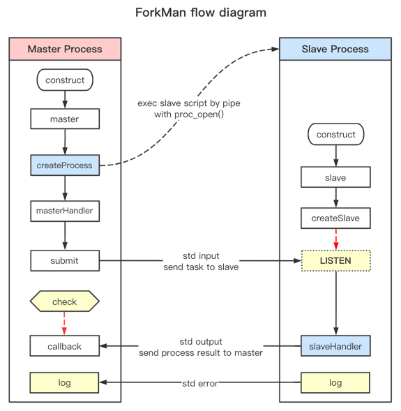

# ForkMan

> A lightest process manager(inspired by [SimpleFork](https://github.com/SegmentFault/SimpleFork))

## Requirements
- PHP >= 5.5
- functions: `proc_open`

## Install

```bash
composer require upfor/forkman
```

## Example

```php
<?php

use Upfor\ForkMan\ForkMan;

require 'vendor/autoload.php';

$fm = new ForkMan(2);
$fm->master(function (ForkMan $fm) {
    $fm->submit([1, 1000]);
    $fm->submit([1001, 2000]);

    $fm->wait(3000);
})->slave(function ($params, ForkMan $fm) {
    $fm->log($params);
});
```

## Architecture


## License

**ForkMan** is under the [MIT](LICENSE) license.
